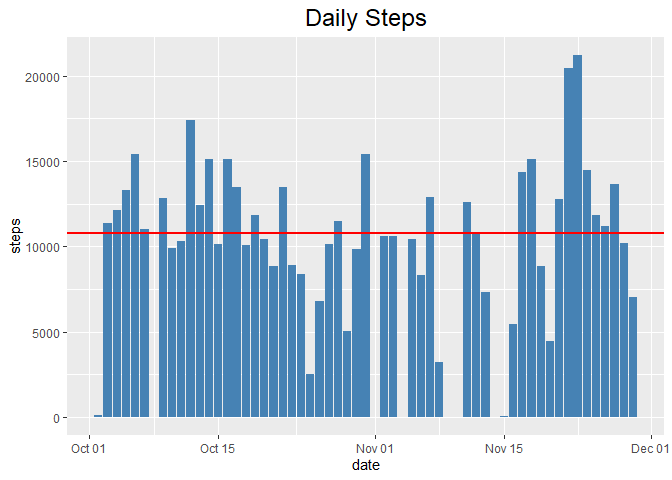
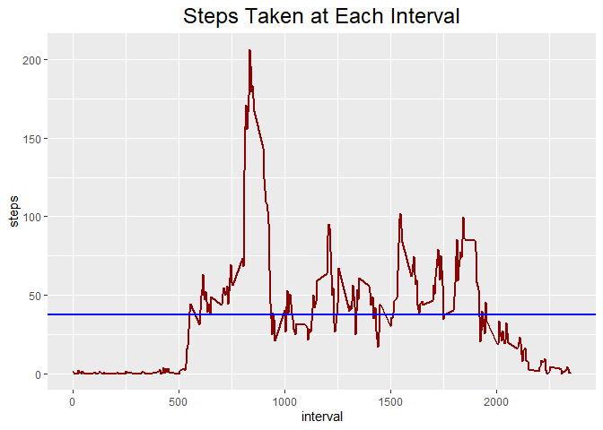
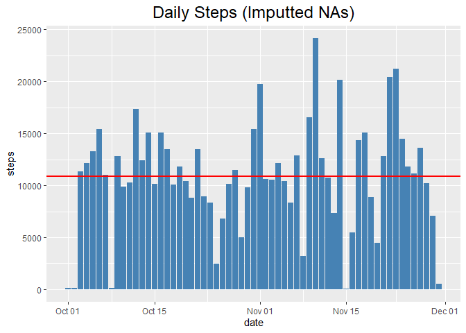
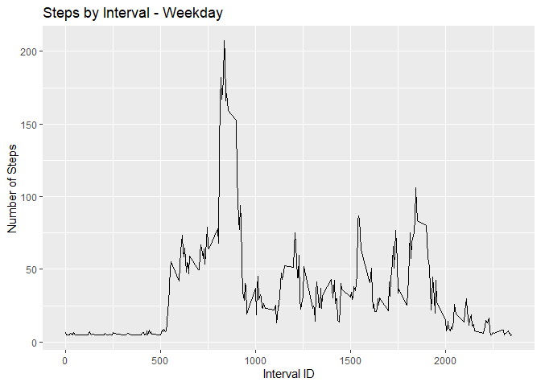
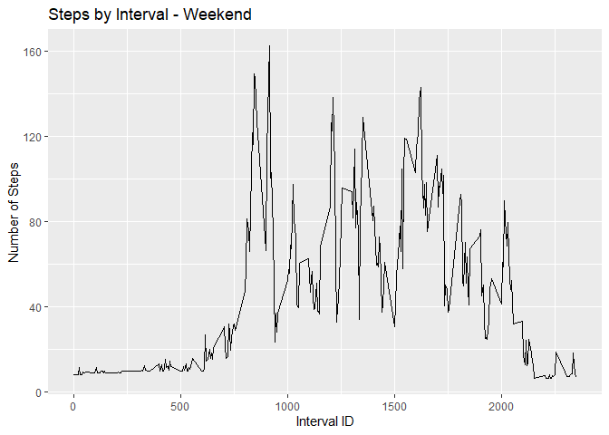

Loading required libraries

``` r
library(reshape2)
library(ggplot2)
library(plyr)
```

Loading and preparing the data

``` r
data <- read.csv("activity.csv", header = TRUE)

data$date <- as.Date(data$date)


actMeltDate <- melt(data, id.vars="date", measure.vars="steps", na.rm=FALSE)
activity <- dcast(actMeltDate, date ~ variable, sum)
```

### Question 1: Calculating and plotting the mean and median of the total number of steps per day

You can also embed plots, for example:

``` r
ggplot(activity, aes(x = date , y = steps)) +
  geom_bar(stat = "identity", fill = "steelblue") +
  geom_hline( yintercept = mean(activity$steps, na.rm = TRUE) , color = "Red", size = 1) +
  ggtitle("Daily Steps") +
  theme(plot.title = element_text(size = 18, hjust = 0.5))
```

    ## Warning: Removed 8 rows containing missing values (position_stack).



Mean and Median

``` r
paste("Mean steps per day = ", mean(activity$steps, na.rm = TRUE))  
```

    ## [1] "Mean steps per day =  10766.1886792453"

``` r
paste("Median steps per day = ", median(activity$steps, na.rm = TRUE))
```

    ## [1] "Median steps per day =  10765"

### Question 2: Calculating and plotting the average daily activity pattern by interval

``` r
actMeltInt <- melt(data, id.vars="interval", measure.vars="steps", na.rm=TRUE)
actCastInt <- dcast(actMeltInt, interval ~ variable, mean)

ggplot(actCastInt, aes(x = interval , y = steps)) +
  geom_line(size= 1, color = "DarkRed") +
  geom_hline(yintercept = mean(actCastInt$steps), color = "Blue", size = 1) +
  ggtitle("Steps Taken at Each Interval") +
  theme(plot.title = element_text(size = 18, hjust = 0.5))
```



``` r
paste("Interval with max value =", actCastInt$interval[which(actCastInt$steps == max(actCastInt$steps))])
```

    ## [1] "Interval with max value = 835"

``` r
paste("Maximum interval mean steps =", max(actCastInt$steps))
```

    ## [1] "Maximum interval mean steps = 206.169811320755"

### Question 3: Imputing missing values to replace NAs in data set and compare results

``` r
#Calculating the total number of missing values in the original data

sum(is.na(data$steps))
```

    ## [1] 2304

Since there are many missing values, I will replace them with the mean
of their respective interval

``` r
# Data frame with mean steps per interval - just renaming to be more descriptive
stepsInt <- actCastInt

# Create data frame that we will remove NAs from
CleanData <- data

# Merge activity data set with stepsPerInt data set
actMerge = merge(CleanData, stepsInt, by="interval", suffixes=c(".act", ".spi"))

# Get list of indexes where steps value = NA
naIndex = which(is.na(CleanData$steps))

# Replace NA values with value from steps.spi
CleanData[naIndex,"steps"] = actMerge[naIndex,"steps.spi"]
```

``` r
actMeltDateNoNA <- melt(CleanData, id.vars="date", measure.vars="steps", na.rm=FALSE)
# Cast data frame to see steps per day
actCastDateNoNA <- dcast(actMeltDateNoNA, date ~ variable, sum)


ggplot(actCastDateNoNA, aes(x = date , y = steps)) +
  geom_bar(stat = "identity", fill = "steelblue") +
  geom_hline( yintercept = mean(actCastDateNoNA$steps, na.rm = TRUE) , color = "Red", size = 1) +
  ggtitle("Daily Steps (Imputted NAs)") +
  theme(plot.title = element_text(size = 18, hjust = 0.5))
```



Mean and Median

``` r
paste("Mean steps per day = ", mean(actCastDateNoNA$steps, na.rm = TRUE))  
```

    ## [1] "Mean steps per day =  10889.7992576554"

``` r
paste("Median steps per day = ", median(actCastDateNoNA$steps, na.rm = TRUE))
```

    ## [1] "Median steps per day =  11015"

### Question 4: Check if differences exist in activity patterns between weekdays and weekends

Creating a factor variable to state whether a day is a weekend or not

``` r
for (i in 1:nrow(CleanData)) {
    if (weekdays(CleanData$date[i]) == "Saturday" | weekdays(CleanData$date[i]) == "Sunday") {
        CleanData$dayOfWeek[i] = "weekend"
    } else {
        CleanData$dayOfWeek[i] = "weekday"
    }
}
```

Subsetting data to plot the graph

``` r
# To create a plot, we must first subset the data
actWeekday <- subset(CleanData, dayOfWeek=="weekday")
actWeekend <- subset(CleanData, dayOfWeek=="weekend")

# Next, we need to process the data for our needs
actMeltWeekday <- melt(actWeekday, id.vars="interval", measure.vars="steps")
actMeltWeekend <- melt(actWeekend, id.vars="interval", measure.vars="steps")
actCastWeekday <- dcast(actMeltWeekday, interval ~ variable, mean)
actCastWeekend <- dcast(actMeltWeekend, interval ~ variable, mean)
```

Plotting graphs

``` r
plot1 <- qplot(interval, steps, geom="line", data=actCastWeekday, type="bar", main="Steps by Interval - Weekday", xlab="Interval ID", ylab="Number of Steps")
```

    ## Warning: Ignoring unknown parameters: type

``` r
plot2 <- qplot(interval, steps, geom="line", data=actCastWeekend, type="bar", main="Steps by Interval - Weekend", xlab="Interval ID", ylab="Number of Steps")
```

    ## Warning: Ignoring unknown parameters: type

``` r
plot1
```



``` r
plot2
```


